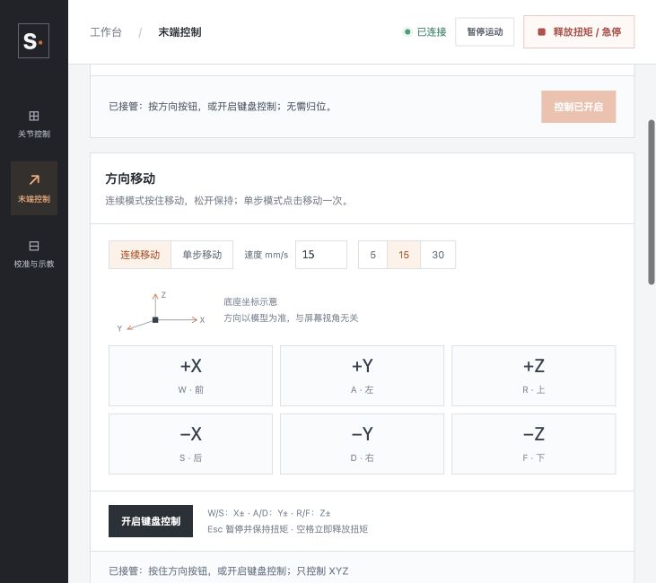

# 2026-10-02 项目收尾报告

> 2026-10-03 验证纠正：PR #7 最终 PR 检查成功，但合并后 main 的 Mac 检查失败，昨日收尾不能视为主线 CI 已完成。原因、修复和长期分支治理见[次日报告](2026-10-03.md)；实物验收范围仍按本文逐项证据理解。

今天完成了 SCS215/SO101 控制基线的统一：共享标定、独立 LeRobot 插件、当前姿态关节接管和上位机 FK/IK 进入同一个应用仓库。普通控制不再被演示起点阻断；界面能区分请求目标与编码器反馈。终端键盘运动已获操作者确认，GUI 末端控制完成离线与模拟页面验证，下一步是实物测量和小规模同步采集。

## 交付与问题解决

| 原问题 | 本日结果 | 证据/边界 |
|---|---|---|
| 课程、双后端、标准 CLI 使用不同适配路径 | 独立可安装 `lerobot_robot_scs215` 插件，注册 `scs215_so101_follower`；直接脚本、课程及标准 CLI 共用总线 | 固定团队 0.6.2 fork 提交，未新增框架源码修改 |
| 设备地址、标定与个人环境混杂 | 标定按实体机械臂共享，串口/摄像头放本机忽略配置；控制/训练独立锁文件 | Mac/Windows 安装指引、锁定 uv 命令及软件 CI |
| 正常姿态被归位/演示入口拒绝 | 普通控制从当前反馈接管；归位与演示独立且默认折叠 | 保持目标先确认，再启用扭矩；未扩大标定范围 |
| 夹爪在合法端点附近阻塞全臂操作 | 仅发送已编辑关节，其他轴保持执行时反馈；端点余量区只允许朝内点动 | 可保持原位，不自动裁剪并移动 |
| 界面难以理解 | 直角瑞士风格、清晰工作区、实时串口枚举、连接摘要和独立反馈 | 串口枚举只读，不代表硬件已连接 |
| 键盘读数变化但实物不动 | 启用与运行时验证扭矩及 Goal_Position，分列 TCP command、encoder FK、joint error | 用户确认修复后可移动；15 mm/s 通过参数选择 |
| FK/IK 只有终端入口 | GUI 增加编码器 FK、连续 XYZ、1/5/10 mm 单步、整条路径预览与执行 | 同源 URDF/关节映射/NumPy FK/DLS IK，夹爪独立 |

连续方向默认请求 15 mm/s，可选 5/15/30。方向会话每约 80 ms 续期，300 ms 失效即暂停保持；输入序号拒绝乱序，失焦/页面切换取消方向并关闭键盘入口。Esc 暂停且保留扭矩，空格/顶部释放按钮停止并释放。XYZ 预览 30 秒有效，起点变化超过 2 刻度需重新预览；完整路径失败不能执行已求解半程。

## 标定与实物证据

人工标定记录了 2,240 个样本、237.192 秒。操作者确认安全范围，五轴 EEPROM 范围更新后回读，腕旋转保持旧指令范围。六轴锁状态最终为 1，采样与写入回执记录扭矩/报警为 0。详见[标定回执](../course/CALIBRATION.md)及历史样本；此过程没有动力全行程运动。

| 关节 | 当前标定 raw 范围 |
|---|---|
| 底座 | 169..898 |
| 肩 | 60..740 |
| 肘 | 196..772 |
| 腕俯仰 | 67..681 |
| 腕旋转 | 47..974 |
| 夹爪 | 239..640 |

插件只读实物连接确认六台型号/ID，前后限位、锁、扭矩和状态一致；标准 `lerobot-calibrate` 验证旧标定没有写 EEPROM。历史双后端小幅同步动作与旧网页视频保留本地。操作者本日反馈新版普通控制“现状很好”，并明确确认终端键盘可以移动；新版 GUI 末端运动尚无附带测量或视频。

收尾时旧网页服务报告串口 `Device not configured`，扭矩关闭无法回读确认。已提醒支撑并切断舵机电源，未尝试驱动、重新接管或重启实物控制。该情况不能记作“已确认停机”。下次使用应先确认供电/连接状态，再启动最新环境。

## 软件验证

- 整合后的完整离线回归：151 项；覆盖协议、共享标定、控制/归位、GUI、FK/IK、连续输入失效、预览失效、硬件故障释放、插件标准 CLI 与视觉回归。
- 控制环境检查与训练软件环境检查通过；应用及插件 wheel 构建通过，前端语法与 diff 检查通过。Mac 没有 NVIDIA CUDA，本日未执行 GPU 训练。
- 标准遥操作/录制测试运行真实框架入口与循环，使用模拟电机、操作者和 RGB 摄像头，生成并核对本地 episode、六轴动作和 Parquet 数据。不是实物同步采集证明。
- 插件 PR 的 macOS、Windows 离线测试与 Windows CUDA 软件安装检查通过。GUI 收尾 [PR #7](https://github.com/EAI-Course-2026/eai_project/pull/7) 的最终托管检查以检查页为准。
- 模拟网页验证当前姿态接管、仅修改关节发送、夹爪朝内点动、XYZ 预览/执行、单步、键盘松开保持及焦点取消。以下图片来自模拟设备，不能用作实物精度证据。



验证曾被本机环境阻断两次：旧环境未安装新插件，以及沙箱禁止 HTTP 测试监听。前者通过锁定依赖同步解决，后者在允许本机监听的离线测试环境重跑。缓存使用本日已验证的 uv 缓存；锁文件与框架版本没有为绕过问题而改动。

整合后的 Windows 托管检查还发现不可达路径求解超过测试助手的 5 秒等待。将离线预览等待改为 30 秒，仍核验完整路径拒绝及关节控制可继续使用；生产输入租期、运动超时与故障处理保持原值。最终结果见 PR #7 的检查记录。

## 仓库与工作区收尾

已有基线、标定、共享配置、Windows/CUDA 和命令指引 PR 已合并。插件及终端修复通过 [PR #5](https://github.com/EAI-Course-2026/eai_project/pull/5) 合并；上位机工作通过 [PR #7](https://github.com/EAI-Course-2026/eai_project/pull/7) 收尾，合并后主线包含全部已验证实现。更新 README、架构、操作指南、里程碑与本报告，清理已合并分支和插件临时工作区，并保留 Git 历史。

本机 `check_hardware.py` 移至忽略目录 `local_artifacts/diagnostics/`，未执行或上传。作业包、旧视频、个人配置、输出数据与环境依然忽略；只删除可重建的临时工作区环境/缓存，不删除本地作业材料。

## 尚未完成的验收

1. 空载低速验证 GUI 当前姿态接管、各轴正负方向、1/5/10 mm 位移；记录实际编码器、模型 FK 与外部测量，检查松键、失焦、预览失效、暂停和释放行为。
2. 确认方向、零点、断电后限位持久性与负载条件。当前 FK 把标定端点映射至 URDF 端点；尚未完成物理对齐与精度测量。XYZ 只约束位置，朝向可能变化，没有碰撞规划。
3. 选择兼容操作者与实际摄像头，录一个短本地 episode，检查时间同步、图像、动作与回放；再开展 GPU 训练和受控策略播放。
4. 在 Windows GPU 主机执行硬件访问与实际 CUDA 验证。视觉整合、底盘和语音仍按独立里程碑推进；选择开源许可证后准备上游贡献。

## 下次启动

```sh
git switch main
git pull --ff-only
uv sync --locked
uv run --locked python scripts/check_env.py
uv run --locked python scripts/arm_desk.py
```

同一串口只运行一个控制进程。GUI 内关节和末端共用硬件线程；独立 `eai-course keyboard` 或标准 LeRobot CLI 必须先退出并断开。报告可引用的软件完成与实物验收范围以本文及[里程碑](../milestones.md)为准。
