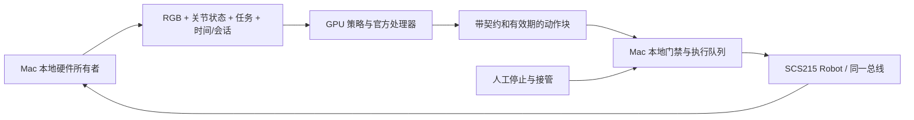

# VLA 部署与适配推理阶段

更新：2026-10-03。本文是下一阶段方案，不表示推理链已实现。已核对应用基线
`be9ac819fed847ad2a00245c7e569d8a7c417146`；运行前重新核对 develop 最新提交。
具体接续入口见 [handoff](handoffs/vla_next_session.md)。

## 目标与决策

把图像、六关节状态和语言任务输入 VLA（Vision-Language-Action），输出经过模型
后处理、契约核验和本地执行门禁的动作，并在真实 SCS215/SO101 上完成一个明确任务。
区分两个交付：模型能加载并输出合格动作；经本机数据适配后能完成指定实物任务。
前者不证明后者，机械臂可动也不证明模型可部署。

建议优先评估 **SmolVLA**，先把一个模型的端到端接口打通，再比较 π₀ 等模型。
官方提供约 450M 参数基础模型和微调流程；这只是选型依据，不是本机已测性能。
基础权重用于加载与离线推理检查，不直接宣称能零样本完成我们的任务。
见 [SmolVLA 官方指南](https://huggingface.co/docs/lerobot/main/smolvla)与
[模型卡](https://huggingface.co/lerobot/smolvla_base)。

建议 Mac 继续负责串口、相机、人工停止与动作执行，NVIDIA 主机负责推理/微调。
先完成离线与同步单步接口，再评估异步动作块，避免同时调试设备、网络与调度。
GPU 尚未确认时，可以开展模型契约、假策略、录制和离线回归；CPU/MPS 是否满足
实际时延必须实测，不先承诺性能。Windows GPU 主机也可以独立连接整套设备，
但那需要单独通过 Windows 实物验收。

## 当前证据

| 部分 | 已有 | 本阶段缺口 |
|---|---|---|
| 硬件通信 | 六台型号 1315、协议 1、1024 刻度；双后端与共享标定 | 全负载/供电稳定性、连续策略执行 |
| 人工控制 | 终端键盘已由用户确认可移动；启动和运行扭矩/目标回读 | 不把模型 TCP 当成实际测量；GUI 新版实物验收仍待完成 |
| FK/IK | URDF FK、DLS 位置 IK、直线规划、GUI 单线程调度与输入租期 | 编码器零点/尺度到真实角度的独立核验；无碰撞规划 |
| LeRobot 插件 | `scs215_so101_follower` 已注册，共用 Robot/总线，RGB 相机接口 | 真实图像+关节观测时序、策略消费与执行验收 |
| 录制 | 模拟设备运行标准录制并生成本地 RGB episode | 真实完整示范、动作标签语义、训练/验证划分 |
| 环境 | 控制与训练各自 uv.lock；Windows CUDA 软件 CI | 具体 GPU、驱动、显存和真实算子/模型推理 |
| VLA | 固定框架源码包含策略工厂、SmolVLA、异步 server/client | 未建立应用级推理模块、权重清单、适配数据和评估报告 |

证据边界以 [README](../README.md)、[里程碑](milestones.md)、
[架构](architecture.md)、[插件验证](lerobot_plugin_validation.md)为准。
本轮仅整理文档，没有打开硬件、下载权重或执行 GPU 验收。

## 依赖和源码边界

应用、硬件插件、模型适配和部署代码都在本仓库维护。继续固定 **LeRobot 0.6.2 fork**
`6a077907c7989635218969ee78f5436f8faec92b`；旧 0.6.1 只作迁移对照。
禁止用 PyPI 同版本或官方 main 替代这个提交，禁止修改 site-packages。
优先调用策略工厂、pre/post processors、Robot 接口与已有传输层。
只有扩展接口确实不足，才提交最小框架补丁，单独评审并同步更新两套锁与回归。

根控制环境保持轻量；不要为了 CUDA 推理将它改成 CUDA 环境。
现有 `environments/training/` 使用 `lerobot[training,core_scripts,feetech]`，
不能据此认为已具备 SmolVLA 和 async 的全部可选依赖。固定源码的 metadata 将
`smolvla`、`async` 分为 extras；下一 session 先核对再在相应项目显式声明并更新锁。
先复用训练环境完成模型 smoke test；只有推理和训练的依赖、部署生命周期确实分离时，
再增加 `environments/inference/` 及独立锁。Mac 网络客户端所需传输依赖也单独核实。
不要以临时 `pip install` 代替可复现配置。

官方文档链接是动态 main。安装参数、处理器与客户端行为以锁定 fork 的实际源码为准。
本轮已核对 `lerobot.policies.factory`、`lerobot.async_inference` 与包 metadata；
这些模块存在，不等于本仓库已验收其行为。

## 优先解决的卡点

1. **模型输出语义。** 同为 SO101，关节顺序、角度零点、归一化统计和夹爪定义也可能不同。
   六个维度相同不等于兼容。我们的五个手臂目标是 `-100..100`，夹爪是 `0..100`，
   均为标定范围归一化量，不是弧度、角度或 TCP。未知契约拒绝执行。
2. **摄像头与同步。** 只有历史 USB 识别和拍摄信息，没有当前同步 episode 的证据。
   核对 RGB/BGR、分辨率、帧率、布局、视角、相机键与 checkpoint 的输入要求。
   不用重复同一幅图假装第二视角；缺少视角需模型明确支持或使用匹配数据适配。
3. **示范与适配。** 先选一个固定桌面任务和成功标准，定义操作者入口。
   只有 follower，不假设存在 leader。可实现记录 GUI/键盘实际发送的关节动作的 recorder，
   或经过验证的 LeRobot Teleoperator 包装；现有键盘脚本尚不是标准 Teleoperator。
   不将 IK 请求 XYZ、未经执行的目标或裁剪前的策略输出当成真实关节动作。
4. **GPU 与时延。** 记录 GPU/显存/驱动、CUDA 算子、模型精度、warmup、p50/p95 推理时延、
   峰值显存和动作块时间跨度。控制 Hz、模型调用 Hz 和相机 FPS 是不同指标。
5. **本地执行与断线。** GPU 输出不能绕过本地限位、扭矩、反馈、停止和时序检查。
   当前 GUI 300 ms 输入租期用于人工控制，不应直接复制成远程推理超时；单独定义
   观测年龄、动作到期、缓存上限与故障行为，并保留迟到动作不可恢复旧会话的测试。

位置 IK 不是 VLA 的必经层。推荐首版输出六个关节绝对目标，走同一个 Robot 接口。
只有选定 checkpoint 明确输出 Cartesian 动作时，才引入坐标系、旋转表达、TCP 和 IK
适配；当前的 raw 范围线性映射到 URDF 角度假设尚需实测，不能凭范围标定保证厘米精度。

## 建议仓库架构（新增部分尚不存在）

```text
plugins/lerobot_robot_scs215/  已有：唯一硬件 Robot 与总线
src/eai_robot/arm/            已有：GUI、人工控制、单硬件线程
src/eai_robot/course/         已有：FK/IK、键盘与课程视觉
src/eai_robot/policy/         拟新增
  contracts.py               observation/action/model manifest
  observations.py            图像/六关节/语言任务的模型输入适配
  actions.py                 模型后处理、排序、单位与 raw 换算
  runtime.py                 无硬件的策略加载、reset、推理
  safety.py                  动作块、超时、步长与反馈门禁
  execution.py               本地唯一串口所有者的执行适配
  recording.py               真实观测、发送动作与反馈记录
  evaluation.py              延迟、跟踪、任务成功与失败分类
  cli.py                     inspect / dry-run / shadow / run 等拟议入口
configs/policy/              拟新增：可分享模型/任务模板
environments/training/       已有：微调与首轮 GPU smoke test
environments/inference/      可选：明确有拆分需求后建立
tests/test_policy_*.py        拟新增：无硬件、假时钟与故障注入
docs/policy/                 拟新增：实际实现后的运行/契约指南
data/ checkpoints/ outputs/  已忽略：数据、权重和运行日志
```

这些是职责边界，首个 PR 按实际需要建最少模块，不先生成空框架或第二份通信代码。



GUI 与 headless runner 可以共享执行接口，但不能同时创建两个串口持有者。
首版选择 GUI 完全断开的 headless runner，易于验证；后续接 GUI 也必须复用服务的
同一硬件线程。不要从推理线程直接访问正在被 GUI 使用的 Robot。

优先评估 LeRobot 已有异步传输，而非重写模型服务器。固定客户端构造时直接
`make_robot_from_config(...).connect()`，必须核验连接/启用和关闭语义；不可照抄教程
让它自动接管硬件。现有服务使用 insecure gRPC 并包含 pickle 序列化，只在可信的
受限网络评估；不要直接暴露公网。跨机上线需明确网络隔离/隧道、身份与超时边界。
官方 [异步指南](https://huggingface.co/docs/lerobot/main/async)仅作接口参考。

## 必须冻结的契约

- 模型 manifest：模型 ID、不可变 revision、框架 SHA、处理器与 tokenizer revision、
  配置、统计文件、精度、设备和文件摘要；权重不进 Git。
- 关节顺序：`shoulder_pan, shoulder_lift, elbow_flex, wrist_flex, wrist_roll, gripper`。
  observation 与 action 各自显式说明顺序，不依赖 dict 恰好同序。
- state/action：维度、单位、绝对/增量、坐标系、夹爪方向、动作频率、标定摘要；
  模型标准化只能由匹配的 pre/post processors 应用一次，不能重复反归一化。
- 图像：稳定的相机键、RGB、shape/layout、采样与获取时间；处理器完成 resize/normalize。
- 会话与时序：session、request sequence、观测/动作关联、采集间隔、动作有效期、chunk 长度。
  两台机器的 monotonic 时间不能直接相减；用本机往返计时和本机 deadline，
  若需要跨机采集年龄比较则明确时钟同步/偏移估计。
- 数据动作标签：区分模型请求、经后处理请求、本地实际发送与后续编码器反馈。
  保留拒绝原因；若运行中再裁剪动作，数据不能仍把裁剪前目标标成执行动作。

## 实施顺序与验收

| 阶段 | 交付与通过条件 | 禁止混称 |
|---|---|---|
| P0 契约/设备盘点 | GPU 信息、任务、checkpoint 输入输出、相机要求、兼容性报告 | import 成功不等于模型可用 |
| P1 离线部署 | 固定权重与处理器；样例图像+六维 state+task 输出有限且 shape 正确的动作；记录时延/显存 | 无硬件推理不等于可执行 |
| P2 假策略执行器 | 顺序/单位/范围、首步跳变、报警、扭矩丢失、断网/乱序/过期、暂停和接管回归 | 测试不触碰实物 |
| P3 只读 shadow | 真实相机与状态输入模型，只预览输出；无目标或扭矩写入 | 输出看似合理不等于任务成功 |
| P4 数据与适配 | 真实同步 episode、完整性/回放检查、成功条件与场景划分；微调或明确已有匹配 checkpoint | 换单位不能替代任务微调 |
| P5 受控 rollout | 用户明确授权；首动作连续性、小范围、人工停止、有限时长；比较发送/反馈与任务结果 | 可动不等于稳定完成任务 |
| P6 评估/交接 | 固定 checkpoint、独立评估场景、成功率/次数、失败原因、延迟与复现配置 | CI 不等于 GPU/实物验收 |

P3/P4 依赖真实设备，P1/P2 可先并行于团队设备准备，但不必开多个串口进程。
若只有基础权重，P3 后默认进入 P4；不直接开启自主任务。训练和评估按 episode/场景
隔离，不随机拆相邻帧。样本数、时延预算、步长/速度阈值在实际任务与设备盘点后填写，
本文件不编造硬件指标或保证成功率。

首个建议开发 PR：checkpoint manifest + observation/action 契约 + fake policy + 离线
dry-run + 执行门禁测试。验收为不连接硬件也能确定模型的输出如何映射到六关节。
GUI 模型面板、多模型排行榜、量化、RTC 和训练服务化留到这条链验证后。
